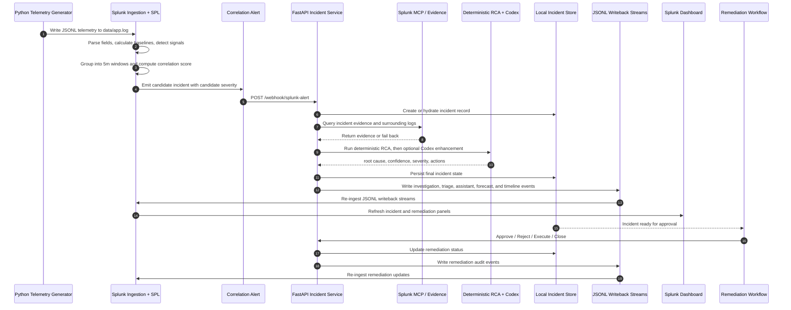

# Incident Flow Sequence

This document reflects the current repo flow in `app/main.py`, `app/telemetry.py`, `app/storage.py`, and the workflow documented in `README.md`.

## Summary

- Python generates telemetry and incident bursts, then writes JSONL events to `data/app.log`.
- Splunk ingests the JSONL streams, extracts fields, and runs baseline, anomaly, and correlation searches.
- Correlation searches produce candidate incidents and candidate severity values.
- FastAPI owns the canonical incident record in `data/incidents.json`.
- Incidents can be created directly through `POST /incidents/create` or hydrated from `POST /webhook/splunk-alert`.
- Investigation uses Splunk MCP evidence when available, deterministic RCA as the fallback, and an optional Codex second pass.
- Investigation and remediation write back into JSONL logs that Splunk can re-ingest for dashboard visibility.
- Remediation is gated by investigation completion and approval.

## Stage-by-Stage Flow

### 1. Telemetry generation

- `app/telemetry.py` generates normal traffic and incident bursts.
- Normal events include service, host, endpoint, status code, latency, dependency, deployment version, and timeline stage.
- Incident bursts are injected with IDs in the format:

```text
inc-YYYYMMDDHHMMSS-xxxxxx
```

- Manually created incidents use the default model-generated ID format:

```text
inc-<uuid>
```

- Demo timeline events can also use `inc-demo-<minute>-<incident_type>` when the deterministic scenario generator is used.

### 2. Splunk ingestion

- Splunk monitors the JSONL files under `data/`.
- The main telemetry stream is `data/app.log` with `sourcetype="agentic-ops"`.
- Workflow writeback streams include:
  - `data/incidents.log`
  - `data/aiops_investigations.log`
  - `data/aiops_remediation.log`
  - `data/ai_triages.log`
  - `data/ai_assistant.log`
  - `data/forecast.log`
  - `data/timeline.log`
  - `data/correlation.log`
  - `data/mcp_metrics.log`
  - `data/splunk_ai_activity.log`

- `data/incidents.json` is the canonical local store and is not ingested by Splunk.

### 3. Baseline, noise reduction, and correlation

- Splunk calculates service baselines from the telemetry stream.
- The searches compute latency averages, standard deviation, z-scores, and resource-pressure signals.
- Events are classified as signal or noise.
- Correlation groups signals into 5-minute windows and aggregates:
  - signal count
  - unique signal types
  - affected hosts
  - affected endpoints
  - affected traces
  - resource pressure
- The correlation search assigns a candidate severity of `HIGH`, `MEDIUM`, or `LOW` based on the correlation score.
- Correlated evidence is also written back through `write_correlation_event(...)` so the dashboard can show correlation history after the alert has been processed.

### 4. Incident intake

- FastAPI can create an incident with `POST /incidents/create`.
- If `inject_burst` is enabled, the API injects a telemetry burst first and reuses that incident ID.
- Splunk can also hand off alert payloads through `POST /webhook/splunk-alert`.
- The webhook path accepts top-level or nested alert fields such as:
  - `search_name` / `alert_name` / `name`
  - `host`
  - `service`
  - `incident_id` / `sid`
  - `severity`
  - `trigger_time` / `triggered_time` / `time`

- When an incident arrives, Python stores the canonical record in `data/incidents.json` and writes incident and remediation audit events.

### 5. Incident hydration and evidence gathering

- If an incident ID is missing from the local store, the app can hydrate it from Splunk MCP evidence.
- During investigation, the app queries Splunk MCP for surrounding evidence and metadata.
- If MCP is unavailable, Python falls back to alert context and deterministic rules.
- The investigation record captures:
  - root cause
  - severity
  - confidence score
  - evidence summary
  - AI summary
  - MCP evidence summary
  - MCP tool usage
  - SPL queries used

### 6. Investigation

- `POST /incidents/{incident_id}/investigate` starts the investigation flow.
- The incident status moves to `INVESTIGATED` first, then to `COMPLETED` once investigation finishes.
- The deterministic RCA engine is the stable baseline.
- If Splunk MCP evidence is available, Codex can refine the RCA using the evidence plus raw event context.
- The app writes:
  - `aiops_investigations.log`
  - `ai_triages.log`
  - `timeline.log`
  - `correlation.log`
  - `aiops_remediation.log`

- Investigation also feeds the AI assistant and forecast artifacts so Splunk can surface the latest reasoning and risk outlook.

### 7. AI assistant and forecast artifacts

- `POST /incidents/{incident_id}/assistant` prepares the assistant prompt and forecast signal.
- `data/ai_assistant.log` stores SPL prompt and suggestion data.
- `data/forecast.log` stores the forecast signal used by the dashboard.
- These artifacts are generated even when the full Codex flow is unavailable, so the dashboard still has a usable operational view.

### 8. Approval and remediation

- Approval requires completed RCA evidence.
- `POST /incidents/{incident_id}/approve` moves the incident to `APPROVED`.
- `POST /incidents/{incident_id}/reject` records a rejected remediation path.
- `POST /incidents/{incident_id}/execute` requires approval and records a simulated safe remediation action.
- `POST /incidents/{incident_id}/close` requires execution before closure.

- The practical lifecycle is:

```text
OPEN -> INVESTIGATED -> COMPLETED -> APPROVED or REJECTED -> EXECUTED -> CLOSED
```

- `remediation_status` mirrors the remediation state, while `status` captures the broader incident lifecycle.

### 9. Writeback and dashboard refresh

- Investigation can write an AI triage summary back to Splunk through HEC when configured.
- If HEC is unavailable, the local triage record still writes to `data/ai_triages.log`.
- Splunk re-ingests the JSONL writeback streams and refreshes the dashboard from those records.
- The dashboard shows:
  - raw telemetry volume
  - correlation candidates
  - investigation summaries
  - MCP evidence and tool usage
  - AI assistant output
  - forecast results
  - remediation state

## Sequence Diagram



## What Splunk Owns Versus What Python Owns

- Splunk owns:
  - ingestion
  - field extraction
  - baseline and anomaly analysis
  - correlation search output
  - candidate severity in the search result
  - dashboard presentation
  - re-ingestion of audit/writeback logs
- Python owns:
  - canonical incident creation
  - incident ID generation when missing
  - hydration from MCP evidence
  - final severity assignment
  - root cause analysis
  - confidence score
  - AI triage and forecast artifacts
  - remediation state transitions
  - writeback events that Splunk can index

## Key Conclusion

Splunk is the detection and correlation layer. Python is the canonical incident and remediation control layer. The severity shown in the correlation search is only a candidate severity; the final incident severity used for investigation and remediation is set by Python after evidence gathering and RCA.
